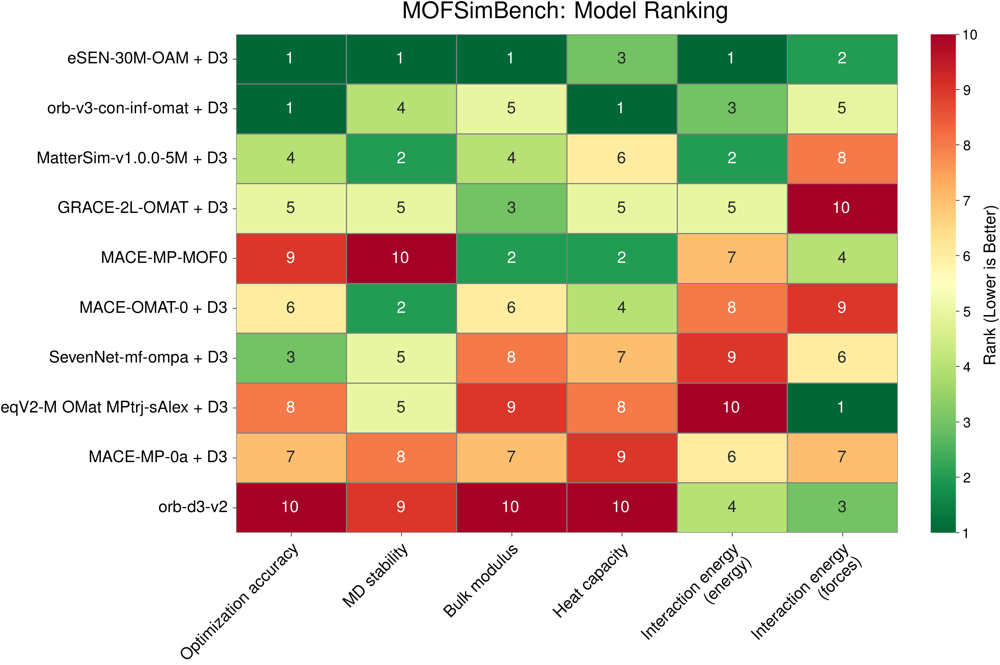

# MOFSim-BenchService: A RESTful API Service for MOF Simulations

[](https://arxiv.org/abs/2507.11806)
[](https://doi.org/10.1038/s41524-025-01872-3)
[](https://www.python.org/)
[](https://fastapi.tiangolo.com/)

> 🔗 **Original Repository**: This project is based on [AI4ChemS/mofsim-bench](https://github.com/AI4ChemS/mofsim-bench), which provides the original MOFSimBench benchmarking framework.



## Overview

**MOFSim-BenchService** is a production-ready RESTful API service that wraps the MOFSimBench benchmarking framework, enabling programmatic access to Universal Machine Learning Interatomic Potentials (uMLIPs) for Metal-Organic Framework (MOF) simulations.

### Key Features

- 🚀 **RESTful API**: Full-featured FastAPI-based REST interface for MOF simulations
- 🔧 **Multiple Task Types**: Supports optimization, stability analysis, bulk modulus, heat capacity, and interaction energy calculations
- 📦 **Model Registry**: Unified interface for multiple uMLIP models (MACE, ORB, GRACE, etc.)
- ⚡ **GPU Scheduling**: Intelligent multi-GPU task scheduling and resource management
- 📊 **Real-time Monitoring**: Task progress tracking, logging, and metrics collection
- 🔔 **Alerting System**: Configurable alerts for task failures and system issues
- 🐳 **Docker Ready**: Containerized deployment with Docker Compose
- 🧪 **SDK Client**: Python SDK for easy integration

### Architecture

```
┌─────────────────────────────────────────────────────────────┐
│                      API Layer (FastAPI)                     │
├─────────────────────────────────────────────────────────────┤
│  Routers: Tasks | Models | Structures | System | Alerts     │
├─────────────────────────────────────────────────────────────┤
│                     Core Services                            │
│  ┌─────────────┐ ┌─────────────┐ ┌─────────────────────────┐│
│  │Task Service │ │Structure Svc│ │     Model Registry      ││
│  └─────────────┘ └─────────────┘ └─────────────────────────┘│
├─────────────────────────────────────────────────────────────┤
│                    Scheduler Layer                           │
│  ┌─────────────┐ ┌─────────────┐ ┌─────────────────────────┐│
│  │GPU Manager  │ │Priority Queue│ │   Task Lifecycle       ││
│  └─────────────┘ └─────────────┘ └─────────────────────────┘│
├─────────────────────────────────────────────────────────────┤
│                    Worker Layer (Celery)                     │
└─────────────────────────────────────────────────────────────┘
```

---

## About MOFSimBench

This service is built upon the original MOFSimBench project, which benchmarks the performance of various Universal Machine Learning Interatomic Potentials (uMLIPs) in simulating Metal-Organic Frameworks (MOFs) across different properties, including structural optimization, simulation stability, bulk modulus and heat capacity.

Results of the original benchmark runs can be found here: [https://dx.doi.org/10.6084/m9.figshare.30234010](https://dx.doi.org/10.6084/m9.figshare.30234010)


## Table of Contents

- [🚀 Quick Start](#quick-start)
- [📦 Installation](#installation)
- [⚙️ API Usage](#api-usage)
- [📁 Project Structure](#project-structure)
- [🐳 Docker Deployment](#docker-deployment)
- [📖 Original Benchmark Usage](#original-benchmark-usage)
- [📊 Analyzing Results](#analyzing-results)
- [🤝 Contributing](#contributing)
- [📄 Citation](#citation)


## 🚀 Quick Start

The fastest way to get started is using Docker:

```bash
# Clone and start
git clone https://github.com/lichman0405/mofsim-benchservice.git
cd mofsim-benchservice
docker-compose -f docker/docker-compose.yml up -d

# Access API documentation
open http://localhost:8000/docs
```

Or using Python directly:

```bash
# Install
pip install -e .

# Run (requires Redis and PostgreSQL)
python scripts/run_server.py  # Terminal 1
python scripts/run_worker.py  # Terminal 2
```


## 📦 Installation

### Prerequisites

- Python 3.11+
- PostgreSQL (for production)
- Redis (for task queue)
- CUDA-capable GPU (recommended for model inference)

### Option 1: Quick Start with Docker (Recommended)

```bash
# Clone the repository
git clone https://github.com/lichman0405/mofsim-benchservice.git
cd mofsim-benchservice

# Start all services (API, Worker, PostgreSQL, Redis)
docker-compose -f docker/docker-compose.yml up -d

# API is available at http://localhost:8000
# API documentation: http://localhost:8000/docs
```

### Option 2: Manual Installation

1. **Clone the repository:**

```bash
git clone https://github.com/lichman0405/mofsim-benchservice.git
cd mofsim-benchservice
```

2. **Create a Conda environment:**

```bash
conda create -n mofsim-server python=3.11
conda activate mofsim-server
```

3. **Install dependencies:**

```bash
pip install -e .
```

4. **Install ASE with MTKNPT driver:**

```bash
pip install git+https://gitlab.com/ase/ase.git
```

5. **Set up environment variables:**

```bash
cp config/default.env .env
# Edit .env with your database and Redis settings
```

6. **Initialize the database:**

```bash
alembic upgrade head
```

7. **Start the services:**

```bash
# Terminal 1: Start API server
python scripts/run_server.py

# Terminal 2: Start Celery worker
python scripts/run_worker.py
```


## ⚙️ API Usage

### Python SDK

```python
from sdk.client import MOFSimClient

# Initialize client
client = MOFSimClient(base_url="http://localhost:8000")

# List available models
models = client.list_models()
print(models)

# Submit an optimization task
task = client.submit_task(
    task_type="optimization",
    model_name="mace_mof_large",
    structure_id="HKUST-1",
    parameters={"fmax": 0.05, "max_steps": 500}
)

# Check task status
status = client.get_task_status(task["task_id"])
print(status)

# Get results when completed
results = client.get_task_results(task["task_id"])
```

### REST API Endpoints

| Endpoint | Method | Description |
|----------|--------|-------------|
| `/api/v1/models` | GET | List available models |
| `/api/v1/structures` | GET | List uploaded structures |
| `/api/v1/structures` | POST | Upload a new structure |
| `/api/v1/tasks` | POST | Submit a new task |
| `/api/v1/tasks/{task_id}` | GET | Get task status |
| `/api/v1/tasks/{task_id}/results` | GET | Get task results |
| `/api/v1/system/gpus` | GET | Get GPU status |
| `/api/v1/health` | GET | Health check |

### Supported Task Types

- **optimization**: Geometry optimization
- **single_point**: Single point energy calculation
- **stability**: Stability analysis (MD simulation)
- **bulk_modulus**: Bulk modulus calculation
- **heat_capacity**: Heat capacity calculation
- **interaction_energy**: Gas-MOF interaction energy


## 📁 Project Structure


The repository is organized as follows:


- `api/`: FastAPI application layer
	- `routers/`: API route handlers
	- `schemas/`: Pydantic models for request/response validation
	- `middleware/`: Error handling and logging middleware
- `core/`: Core business logic
	- `models/`: Model registry and loader
	- `scheduler/`: GPU management and task scheduling
	- `services/`: Task, structure, and log services
	- `tasks/`: Task executors for different calculation types
- `workers/`: Celery worker configuration
- `db/`: Database models and CRUD operations
- `sdk/`: Python SDK client
- `docker/`: Docker configuration files
- `tests/`: Unit and integration tests
- `mof_benchmark/`: Original benchmark package
	- `analysis/`: Scripts and Streamlit pages for analyzing and visualizing results.
	- `experiments/`: Scripts and configurations for running tasks.
		- `scripts/`: Python scripts for different experiments (optimization, stability, heat capacity, bulk modulus).
		- `structures/`: MOF structure definitions.
	- `setup/`: Configuration files for calculators (e.g., `calculators.yaml`, `calculator.py`).


## 🐳 Docker Deployment

```bash
# Build and start all services
docker-compose -f docker/docker-compose.yml up -d --build

# View logs
docker-compose -f docker/docker-compose.yml logs -f

# Stop services
docker-compose -f docker/docker-compose.yml down
```


## 📖 Original Benchmark Usage

The benchmark is optimized to run on distributed systems managed with SLURM and can be run with a single command. On different systems, each task can also be easily called using the respective Python scripts.


### Slurm

Sample files are available for each task. They can be found under `mof_benchmark/experiments/scripts` in the respective task folders. The slurm submission scripts are named `submit.sh`. Adapt them to the required settings on your HPC.

For stability MDs, each structure is submitted in a separate job due to the extended runtime. In this case, the submit script relies on SLURM arrays to distribute the jobs.

With correctly configured `submit.sh` files in the `bulk_modulus`, `heat_capacity`, `optimization`, and `stability` directories, all jobs can easily be submitted via the `run_all.sh` script in `mof_benchmark/experiments/scripts`:

```bash
./run_all.sh your-calculator
```


### Python

All tasks can also be run from Python directly (The SLURM scripts just call these):

E.g., for the optimization task, run:
```bash
python optimization.py --calculator your-model --settings optimization.yaml

```

For the stability tasks, run:
```bash
python stability.py --calculator your-model --settings stability_prod_mtk.yaml --index 0
```

The index (0-99) specifies the structure to run.


### QMOF energy comparison task

As an additional test, we compare the energy predictions of uMLIPs to QMOF DFT references. To run this task, download the QMOF database and place the `qmof_database` folder in `mof_benchmark/experiments/structures`. Make sure to unzip `relaxed_structures.zip`.

### Interaction energy task

To perform the task and analysis, the GoldDAC `test.xyz` file must be placed in the `mof_benchmark/analysis/interaction_energy` directory.
Structures must also be extracted into the `mof_benchmark/experiments/structures/golddac` directory. A python notebook is provided to extract the structures from the `test.xyz` file.


## 📊 Analyzing Results

To compute the results from the experiments, run the analysis scripts in `mof_benchmark/analysis`. You can quickly run everything using:


```bash
./run_analysis.sh
```

Results can then be plotted using the `plots.ipynb` notebook in `mof_benchmark/analysis/plot`.

Additionally, a Streamlit app is available to explore the results in depth.

Run it using:

```bash
cd mof_benchmark/analysis
streamlit run Overview.py
```


## 🤝 Contributing

Contributions are welcome! The project can be extended with new task types, models, and features.

For the original benchmark tasks, refer to the interaction energy task in `mof_benchmark/experiments/scripts/interaction_energy` for a simple example.

For API service contributions:
- Add new task executors in `core/tasks/`
- Add new API endpoints in `api/routers/`
- Add tests in `tests/`


## 📄 Citation

This service is based on MOFSimBench. For more technical details about the benchmark, please refer to the [original paper](https://doi.org/10.1038/s41524-025-01872-3).

If you use this project in your research, please cite the original paper:

```bibtex
@article{krass2025mofsimbench,
  title={MOFSimBench: evaluating universal machine learning interatomic potentials in metal-organic framework molecular modeling},
  author={Kra{\ss}, Hendrik and Huang, Ju and Moosavi, Seyed Mohamad},
  journal={npj Computational Materials},
  year={2025},
  publisher={Nature Publishing Group}
}
```


## Acknowledgments

- Original MOFSimBench: [AI4ChemS/mofsim-bench](https://github.com/AI4ChemS/mofsim-bench)
- Paper: [DOI: 10.1038/s41524-025-01872-3](https://doi.org/10.1038/s41524-025-01872-3)


## License

This project is licensed under the MIT License - see the [LICENSE](LICENSE) file for details.
